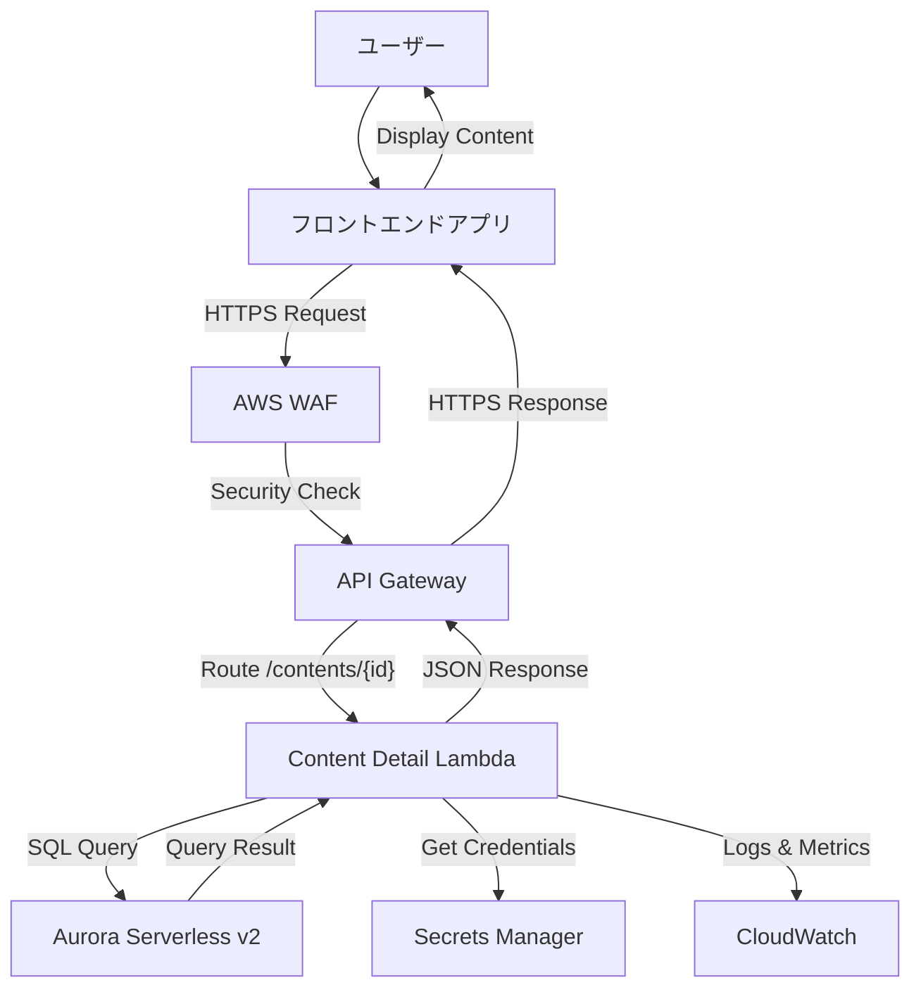
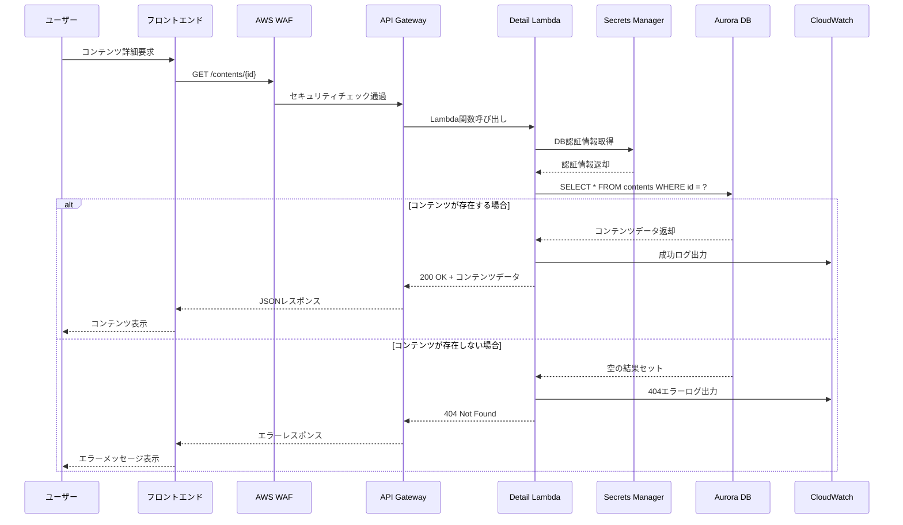
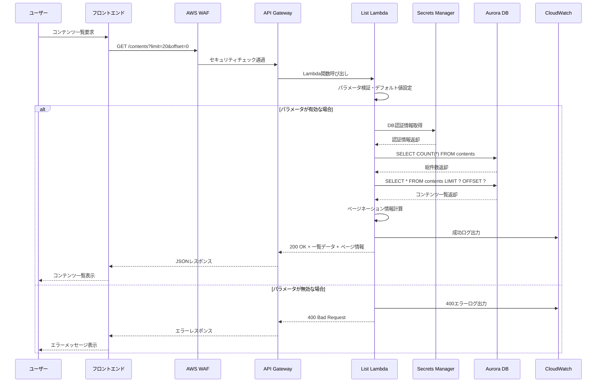
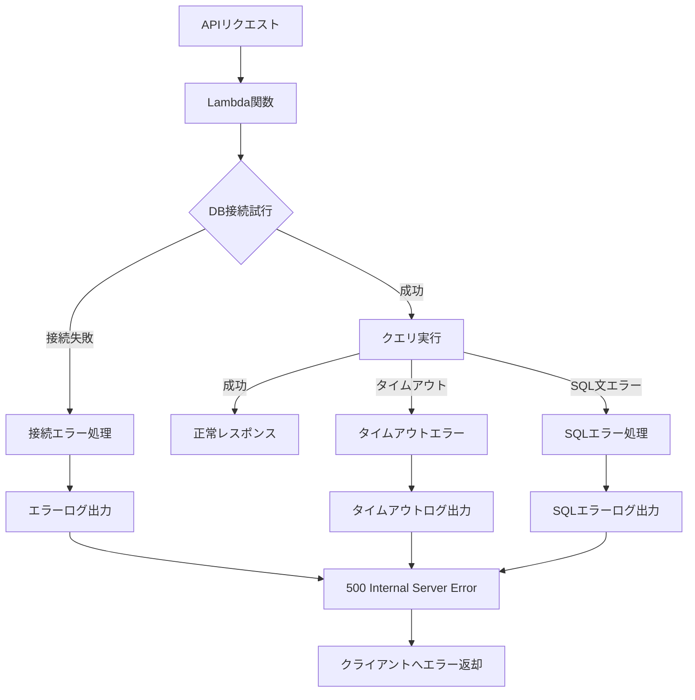
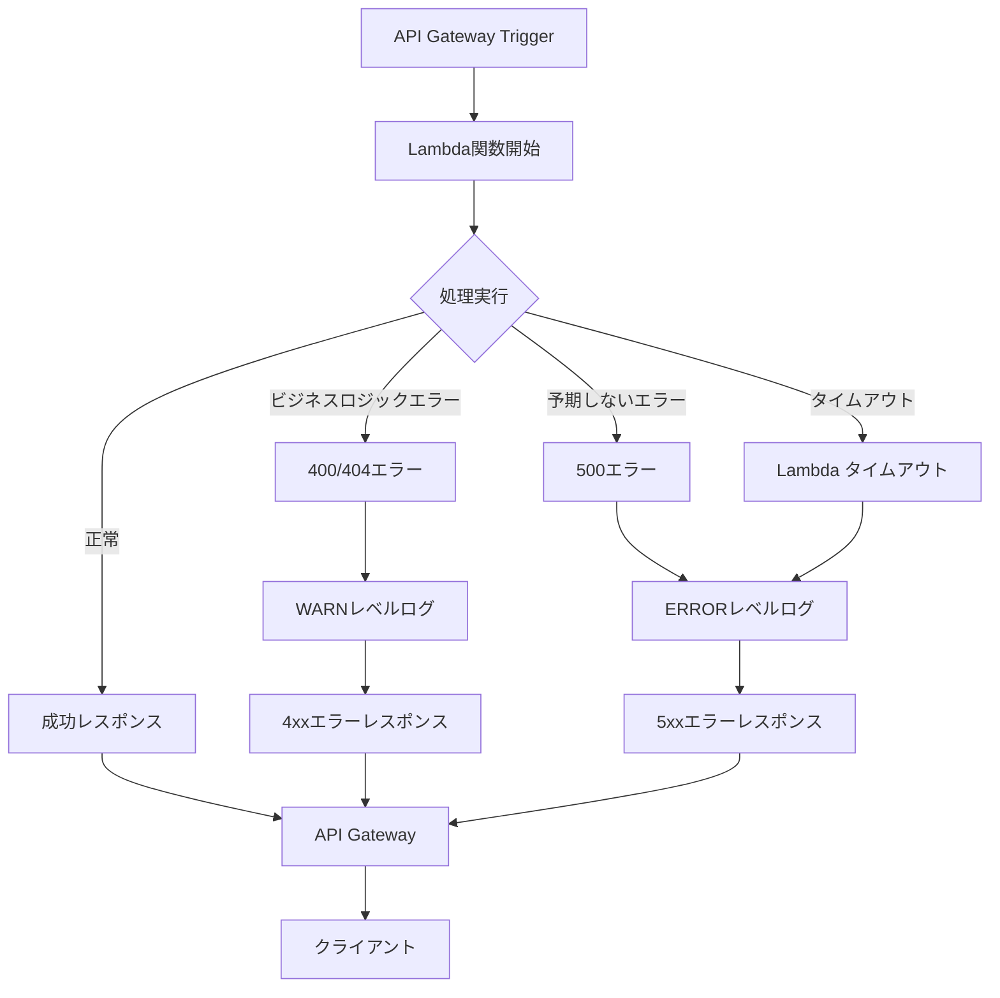
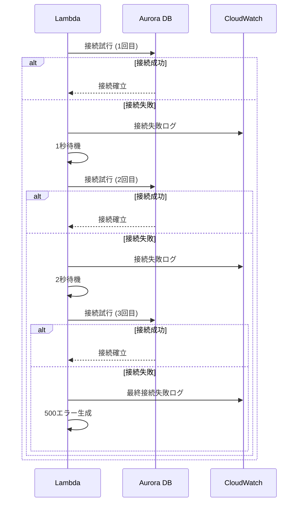
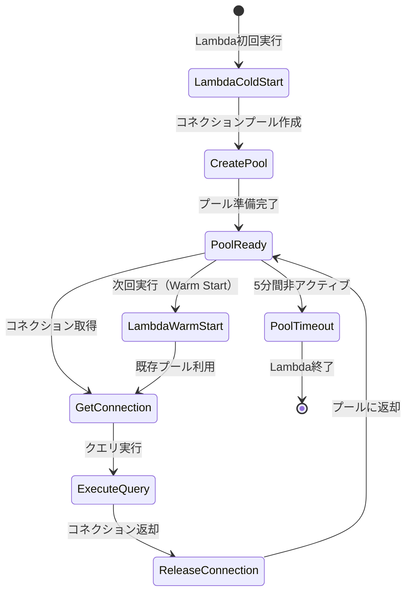
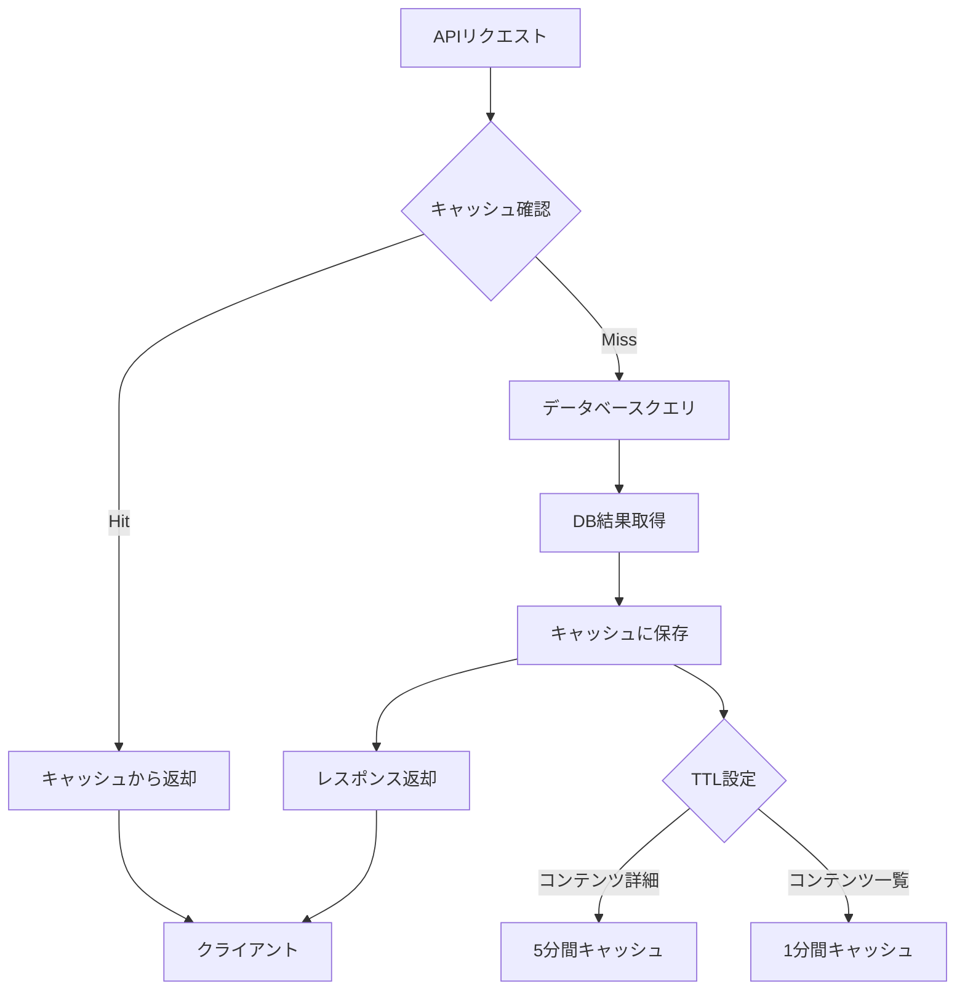
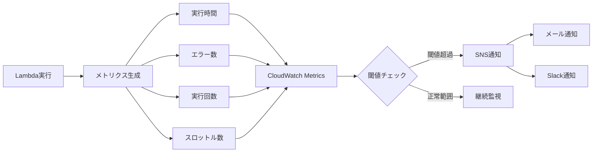

# データフロー図

## ユーザーインタラクションフロー

### システム全体フロー

## データ処理フロー

### コンテンツ詳細取得フロー

### コンテンツ一覧取得フロー

## エラーハンドリングフロー

### データベースエラー処理

### Lambda関数エラー処理

## リトライ・フォールバック戦略

### データベース接続リトライ

## パフォーマンス最適化フロー

### コネクションプール管理

### キャッシュ戦略（将来拡張）

## 監視・アラートフロー

### メトリクス収集フロー

