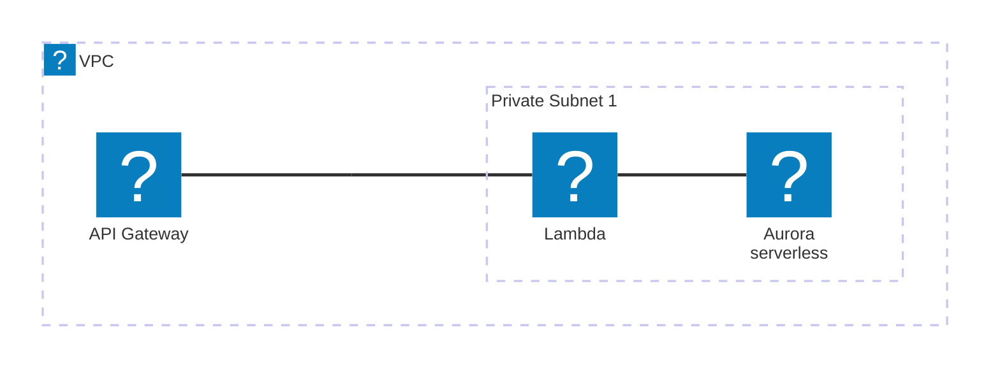

```mermaid
architecture-beta
    group vpc(logos:aws-vpc)[VPC]

    service apigateway(logos:aws-api-gateway)[API Gateway] in vpc

    group private_subnet1[Private Subnet 1] in vpc
    service lambda(logos:aws-lambda)[Lambda] in private_subnet1
    service db_primary(logos:aws-aurora)[Aurora serverless] in private_subnet1

    junction asg_junction in vpc

    apigateway:R -- L:asg_junction
    asg_junction:R -- L:lambda
    lambda:R -- L:db_primary
```
