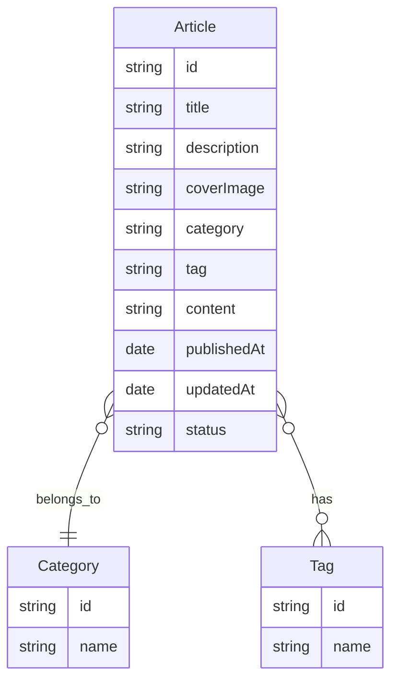

# CMSにおけるDynamoDBのデータモデリングについて
## ユースケース
前提：ユーザーは一旦自分一人で、アクセスも家からのIP制限にする
- 全ての記事をページネーションで取得する（一度に取得する記事数を制限し、次のページのトークンを返す）
- 特定の記事の詳細情報を取得する（単一記事の取得のためページネーション不要）
- 特定の期間の記事をページネーションで取得する
- 全ての期間とその期間に紐づく記事の件数をページネーションで取得する
- 全てのカテゴリをページネーションで取得する（カテゴリ数が少ない場合でも一貫性のため）
- 特定のカテゴリに属する記事をページネーションで取得する
- 特定のタグの付いた記事をページネーションで取得する
- 全てのタグとそのタグに紐づく記事の件数をページネーションで取得する

## エンティティ関係図

## アクセスパターン
記事（Article）関連
- getArticles
- getArticleByID
- getArticlesByDateRange
- getArticlesByCategory
- getArticlesByTag

カテゴリ（Category）関連
- getCategories

タグ（Tag）関連
- getTags

記事数
- getTagsWithArticleCount
- getDateRangeWithArticleCount

## スキーマ設計
```json
{
  "ModelName": "CMS",
  "ModelMetadata": {
    "Author": "DynamoDB設計チーム",
    "DateCreated": "2023-12-10T12:00:00Z",
    "DateLastModified": "2023-12-10T12:00:00Z",
    "Description": "ブログCMS用のDynamoDBシングルテーブルデザイン",
    "Version": "1.0"
  },
  "DataModel": [
    {
      "TableName": "Contents",
      "KeyAttributes": {
        "PartitionKey": {
          "AttributeName": "PK",
          "AttributeType": "S"
        },
        "SortKey": {
          "AttributeName": "SK",
          "AttributeType": "S"
        }
      },
      "NonKeyAttributes": [
        {
          "AttributeName": "type",
          "AttributeType": "S"
        },
        {
          "AttributeName": "title",
          "AttributeType": "S"
        },
        {
          "AttributeName": "description",
          "AttributeType": "S"
        },
        {
          "AttributeName": "content",
          "AttributeType": "S"
        },
        {
          "AttributeName": "coverImage",
          "AttributeType": "S"
        },
        {
          "AttributeName": "publishedAt",
          "AttributeType": "S"
        },
        {
          "AttributeName": "updatedAt",
          "AttributeType": "S"
        },
        {
          "AttributeName": "status",
          "AttributeType": "S"
        },
        {
          "AttributeName": "categoryID",
          "AttributeType": "S"
        },
        {
          "AttributeName": "categoryName",
          "AttributeType": "S"
        },
        {
          "AttributeName": "tagName",
          "AttributeType": "S"
        },
        {
          "AttributeName": "articleCount",
          "AttributeType": "N"
        },
        {
          "AttributeName": "GSI1PK",
          "AttributeType": "S"
        },
        {
          "AttributeName": "GSI1SK",
          "AttributeType": "S"
        }
      ],
      "GlobalSecondaryIndexes": [
        {
          "IndexName": "GSI1",
          "KeyAttributes": {
            "PartitionKey": {
              "AttributeName": "GSI1PK",
              "AttributeType": "S"
            },
            "SortKey": {
              "AttributeName": "GSI1SK",
              "AttributeType": "S"
            }
          },
          "Projection": {
            "ProjectionType": "ALL"
          }
        }
      ],
      "TableData": []
    }
  ]
}
