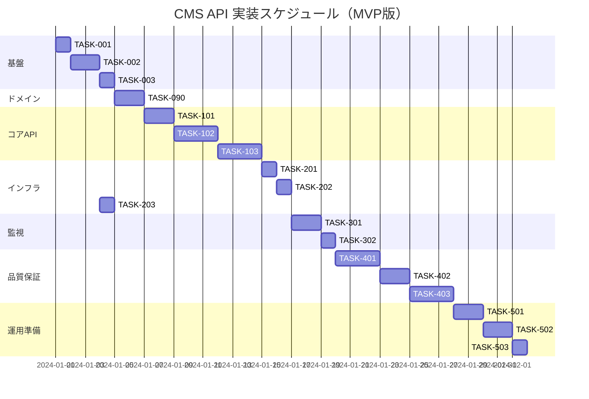

# CMS API 実装タスク

## 概要

全タスク数: 19
推定作業時間: 42時間
クリティカルパス: TASK-001 → TASK-002 → TASK-003 → TASK-090 → TASK-101 → TASK-102 → TASK-103 → TASK-201 → TASK-301

## タスク一覧

### フェーズ1: 基盤構築

#### TASK-001: データベース環境設定

- [ ] **タスク完了**
- **タスクタイプ**: DIRECT
- **要件リンク**: REQ-405, REQ-001, REQ-002
- **依存タスク**: なし
- **実装詳細**:
  - Aurora PostgreSQL 15のスキーマ作成
  - database-schema.sqlの実行（MVP版：ContentRelation関連テーブルは除外）
  - 基本インデックス・ビューの作成
  - 初期テストデータの投入
- **テスト要件**:
  - [ ] データベース接続テスト
  - [ ] スキーマ検証テスト
  - [ ] 初期データ確認テスト
- **完了条件**:
  - [ ] 基本テーブル（contents, content_types, content_blocks, content_block_data）が作成されている
  - [ ] 基本ビュー（content_details, published_contents）が正常に動作している
  - [ ] テストデータが適切に投入されている

#### TASK-002: Go アプリケーション基本設定

- [ ] **タスク完了**
- **タスクタイプ**: DIRECT
- **要件リンク**: REQ-401, REQ-003, REQ-004
- **依存タスク**: TASK-001
- **実装詳細**:
  - Go 1.24.1の環境設定
  - Echo v4.13.4の導入
  - Clean Architecture構造の作成
  - 依存関係注入の実装
  - 環境変数設定
- **テスト要件**:
  - [ ] Go アプリケーション起動テスト
  - [ ] 依存関係注入テスト
  - [ ] 環境変数読み込みテスト
- **完了条件**:
  - [ ] アプリケーションが正常に起動する
  - [ ] Clean Architecture構造が実装されている
  - [ ] 環境変数が正しく読み込まれている

#### TASK-003: AWS Lambda 設定

- [ ] **タスク完了**
- **タスクタイプ**: DIRECT
- **要件リンク**: REQ-402, REQ-004
- **依存タスク**: TASK-002
- **実装詳細**:
  - Lambda Handler実装 (cmd/lambda/main.go)
  - スタンドアロン版実装 (cmd/main.go)
  - Lambda デプロイ設定
  - 環境変数設定
- **テスト要件**:
  - [ ] Lambda Handler動作テスト
  - [ ] ローカル開発サーバー起動テスト
  - [ ] 環境変数取得テスト
- **完了条件**:
  - [ ] Lambda環境で正常動作する
  - [ ] ローカル環境で開発サーバーが動作する
  - [ ] デプロイ設定が完了している

### フェーズ2: ドメインモデル実装（MVP版）

#### TASK-090: ドメインモデル実装（MVP版）

- [ ] **タスク完了**
- **タスクタイプ**: TDD
- **要件リンク**: REQ-001, REQ-002, Clean Architecture原則
- **依存タスク**: TASK-003
- **実装詳細**:
  - `internal/domain/entity/content.go` - Content構造体とビジネスルール
  - `internal/domain/entity/content_type.go` - ContentType構造体
  - `internal/domain/entity/content_block.go` - ContentBlock構造体
  - `internal/domain/entity/content_block_data.go` - ContentBlockData構造体
  - ドメインバリデーションロジック（UUID検証、ステータス検証等）
  - ドメイン固有の値オブジェクト実装
- **テスト要件**:
  - [ ] 単体テスト: Content エンティティ
  - [ ] 単体テスト: ContentType エンティティ  
  - [ ] 単体テスト: ContentBlock エンティティ
  - [ ] 単体テスト: ContentBlockData エンティティ
  - [ ] 単体テスト: ドメインバリデーション
  - [ ] 単体テスト: 値オブジェクト
- **完了条件**:
  - [ ] 全ドメインエンティティが実装されている
  - [ ] ビジネスルールがエンティティに実装されている
  - [ ] バリデーションロジックが動作している
  - [ ] 他の層に依存しない独立した実装になっている

### フェーズ3: コアAPI実装

#### TASK-101: ヘルスチェックエンドポイント実装

- [ ] **タスク完了**
- **タスクタイプ**: TDD
- **要件リンク**: REQ-201, NFR-403
- **依存タスク**: TASK-090
- **実装詳細**:
  - GET /healthcheck エンドポイント実装
  - ヘルスチェックユースケース実装
  - データベース接続確認
  - システム状態チェック
  - レスポンス形式の実装
- **テスト要件**:
  - [ ] 単体テスト: ヘルスチェックユースケース
  - [ ] 単体テスト: ヘルスチェックコントローラー
  - [ ] 統合テスト: エンドポイント動作確認
  - [ ] エラーハンドリングテスト: DB接続失敗時
- **エラーハンドリング**:
  - [ ] データベース接続失敗: 503 Service Unavailable
  - [ ] 部分的サービス障害: 200 OK（詳細情報付き）
  - [ ] 予期しないエラー: 500 Internal Server Error
- **完了条件**:
  - [ ] ヘルスチェックエンドポイントが正常動作する
  - [ ] データベース状態が正確に報告される
  - [ ] 適切なHTTPステータスコードが返却される

#### TASK-102: コンテンツ詳細取得API実装

- [ ] **タスク完了**
- **タスクタイプ**: TDD
- **要件リンク**: REQ-001, REQ-101
- **依存タスク**: TASK-101
- **実装詳細**:
  - GET /contents/{id} エンドポイント実装
  - コンテンツ詳細取得ユースケース実装
  - コンテンツリポジトリ実装（Aurora PostgreSQL対応）
  - パスパラメータ検証（UUID）
  - ブロックデータ取得・構築
  - レスポンス形式の実装
- **テスト要件**:
  - [ ] 単体テスト: コンテンツ取得ユースケース
  - [ ] 単体テスト: コンテンツリポジトリ
  - [ ] 単体テスト: コンテンツコントローラー
  - [ ] 統合テスト: エンドポイント動作確認
  - [ ] 境界値テスト: 有効/無効なUUID
- **エラーハンドリング**:
  - [ ] 無効なUUID形式: 400 Bad Request
  - [ ] コンテンツが見つからない: 404 Not Found
  - [ ] データベース接続エラー: 500 Internal Server Error
  - [ ] タイムアウト: 504 Gateway Timeout
- **完了条件**:
  - [ ] 正常なコンテンツ詳細取得ができる
  - [ ] ブロックデータが適切に構築される
  - [ ] エラーケースが適切に処理される
  - [ ] レスポンス形式が仕様通りである

#### TASK-103: コンテンツ一覧取得API実装

- [ ] **タスク完了**
- **タスクタイプ**: TDD
- **要件リンク**: REQ-002, REQ-102
- **依存タスク**: TASK-102
- **実装詳細**:
  - GET /contents エンドポイント実装
  - コンテンツ一覧取得ユースケース実装
  - クエリパラメータ処理（limit, offset, status, category, tags, search, sort, order）
  - ページネーション実装
  - フィルタリング機能実装
  - ソート機能実装
- **テスト要件**:
  - [ ] 単体テスト: コンテンツ一覧取得ユースケース
  - [ ] 単体テスト: ページネーションロジック
  - [ ] 単体テスト: フィルタリングロジック
  - [ ] 単体テスト: ソートロジック
  - [ ] 統合テスト: エンドポイント動作確認
  - [ ] 境界値テスト: limit/offsetの境界値
- **エラーハンドリング**:
  - [ ] 無効なクエリパラメータ: 400 Bad Request
  - [ ] limit範囲外の値: デフォルト値使用
  - [ ] offset負の値: 0として扱う
  - [ ] データベースエラー: 500 Internal Server Error
- **完了条件**:
  - [ ] コンテンツ一覧取得ができる
  - [ ] ページネーションが正常動作する
  - [ ] フィルタリング・ソート機能が動作する

### フェーズ4: インフラストラクチャ実装

#### TASK-201: API Gateway統合

- [ ] **タスク完了**
- **タスクタイプ**: DIRECT
- **要件リンク**: REQ-003, REQ-403, REQ-404
- **依存タスク**: TASK-103
- **実装詳細**:
  - API Gateway REST APIの設定
  - Lambda関数との統合
  - CORS設定
  - カスタムドメイン設定
  - レスポンス変換設定
- **テスト要件**:
  - [ ] API Gateway経由でのエンドポイントアクセステスト
  - [ ] CORS設定確認テスト
  - [ ] エラーレスポンス形式テスト
- **完了条件**:
  - [ ] API Gateway経由でAPIにアクセスできる
  - [ ] CORS設定が適切に動作する
  - [ ] HTTPSでのアクセスが可能である

#### TASK-202: AWS WAF セキュリティ設定

- [ ] **タスク完了**
- **タスクタイプ**: DIRECT
- **要件リンク**: NFR-102, NFR-104
- **依存タスク**: TASK-201
- **実装詳細**:
  - AWS WAF Web ACLの作成
  - マネージドルールの設定
  - レート制限ルールの設定
  - SQLインジェクション防御
  - XSS攻撃防御
- **テスト要件**:
  - [ ] 正常リクエストの通過確認
  - [ ] 悪意のあるリクエストのブロック確認
  - [ ] レート制限の動作確認
- **完了条件**:
  - [ ] WAFルールが正常に動作する
  - [ ] セキュリティ要件を満たしている
  - [ ] レート制限が適切に機能する

#### TASK-203: Secrets Manager統合

- [ ] **タスク完了**
- **タスクタイプ**: DIRECT
- **要件リンク**: NFR-103
- **依存タスク**: TASK-002
- **実装詳細**:
  - データベース認証情報のSecrets Manager管理
  - Lambda関数からの認証情報取得
  - 自動ローテーション設定
  - アクセス権限設定
- **テスト要件**:
  - [ ] 認証情報取得テスト
  - [ ] 権限設定確認テスト
  - [ ] ローテーション動作テスト
- **完了条件**:
  - [ ] データベース認証情報が安全に管理されている
  - [ ] Lambda関数から認証情報を取得できる
  - [ ] 自動ローテーションが設定されている

### フェーズ5: 監視・ログ実装

#### TASK-301: CloudWatch 監視設定

- [ ] **タスク完了**
- **タスクタイプ**: DIRECT
- **要件リンク**: NFR-401, NFR-402
- **依存タスク**: TASK-202
- **実装詳細**:
  - CloudWatch Logs設定
  - 構造化ログ実装
  - カスタムメトリクス実装
  - ダッシュボード作成
  - アラート設定
- **テスト要件**:
  - [ ] ログ出力確認テスト
  - [ ] メトリクス収集確認テスト
  - [ ] アラート動作確認テスト
- **完了条件**:
  - [ ] 適切なログが出力されている
  - [ ] メトリクスが収集されている
  - [ ] アラートが正常に動作する

#### TASK-302: X-Ray トレーシング設定

- [ ] **タスク完了**
- **タスクタイプ**: DIRECT
- **要件リンク**: NFR-402
- **依存タスク**: TASK-301
- **実装詳細**:
  - X-Ray SDKの統合
  - トレーシングの実装
  - セグメント・サブセグメント設定
  - サービスマップの構築
- **テスト要件**:
  - [ ] トレース情報の収集確認
  - [ ] サービスマップの表示確認
  - [ ] パフォーマンス分析機能確認
- **完了条件**:
  - [ ] トレーシングが正常に動作する
  - [ ] サービスマップが表示される
  - [ ] パフォーマンス分析ができる

### フェーズ6: パフォーマンス最適化・品質保証

#### TASK-401: パフォーマンステスト実装

- [ ] **タスク完了**
- **タスクタイプ**: TDD
- **要件リンク**: NFR-001, NFR-002, NFR-003
- **依存タスク**: TASK-302
- **実装詳細**:
  - 負荷テストツールの設定
  - レスポンス時間測定
  - 同時接続数テスト
  - データベースクエリ最適化
  - コネクションプール最適化
- **テスト要件**:
  - [ ] 1秒以内レスポンス確認テスト
  - [ ] 同時接続数1000テスト
  - [ ] データベースクエリパフォーマンステスト
- **完了条件**:
  - [ ] NFR-001～003の性能要件を満たしている
  - [ ] パフォーマンステストが自動実行できる
  - [ ] 最適化による改善が確認できている

#### TASK-402: セキュリティテスト実装

- [ ] **タスク完了**
- **タスクタイプ**: TDD
- **要件リンク**: NFR-101, NFR-102, NFR-103, NFR-104
- **依存タスク**: TASK-401
- **実装詳細**:
  - セキュリティテストスイート作成
  - SQLインジェクションテスト
  - XSS攻撃テスト
  - 認証・認可テスト
  - 機密情報漏洩チェック
- **テスト要件**:
  - [ ] SQLインジェクション防御確認
  - [ ] XSS攻撃防御確認
  - [ ] ログ出力セキュリティチェック
  - [ ] CORS設定確認
- **完了条件**:
  - [ ] セキュリティ要件を満たしている
  - [ ] 脆弱性が検出・修正されている
  - [ ] セキュリティテストが自動実行できる

#### TASK-403: E2Eテストスイート

- [ ] **タスク完了**
- **タスクタイプ**: TDD
- **要件リンク**: 全要件
- **依存タスク**: TASK-402
- **実装詳細**:
  - E2Eテストフレームワーク導入
  - 主要ユーザーフローテスト
  - エラーシナリオテスト
  - 障害復旧テスト
  - CI/CD統合
- **テスト要件**:
  - [ ] 正常フローのE2Eテスト
  - [ ] エラーハンドリングE2Eテスト
  - [ ] 障害シナリオテスト
  - [ ] 可用性テスト
- **完了条件**:
  - [ ] E2Eテストスイートが完成している
  - [ ] CI/CDパイプラインに統合されている
  - [ ] 全ての受け入れ基準を満たしている

### フェーズ7: 運用準備・文書化

#### TASK-501: IaC実装（Terraform）

- [ ] **タスク完了**
- **タスクタイプ**: DIRECT
- **要件リンク**: 全インフラ要件
- **依存タスク**: TASK-403
- **実装詳細**:
  - Terraform設定ファイルの作成・更新
  - 環境別設定（dev/staging/prod）
  - 既存Terraformコードとの統合
  - 状態ファイル管理
- **テスト要件**:
  - [ ] Terraform plan/apply動作確認
  - [ ] 環境別デプロイ確認
  - [ ] リソース作成・削除確認
- **完了条件**:
  - [ ] 全インフラがTerraformで管理されている
  - [ ] 環境別デプロイが可能である
  - [ ] 既存のTerraform構成と統合されている

#### TASK-502: CI/CD パイプライン構築

- [ ] **タスク完了**
- **タスクタイプ**: DIRECT
- **要件リンク**: 運用要件
- **依存タスク**: TASK-501
- **実装詳細**:
  - GitHub Actions ワークフロー作成
  - ビルド・テスト自動化
  - 段階的デプロイメント
  - ロールバック機能
- **テスト要件**:
  - [ ] ビルド・テスト自動実行確認
  - [ ] デプロイメント動作確認
  - [ ] ロールバック動作確認
- **完了条件**:
  - [ ] CI/CDパイプラインが正常動作する
  - [ ] 自動テスト・デプロイが機能する
  - [ ] ロールバック機能が利用可能である

#### TASK-503: 運用文書作成

- [ ] **タスク完了**
- **タスクタイプ**: DIRECT
- **要件リンク**: 運用要件
- **依存タスク**: TASK-502
- **実装詳細**:
  - 運用マニュアル作成
  - 障害対応手順書作成
  - 監視・アラート手順書作成
  - デプロイメント手順書作成
- **テスト要件**:
  - [ ] 手順書の実行可能性確認
  - [ ] 緊急時対応手順確認
- **完了条件**:
  - [ ] 運用マニュアルが完成している
  - [ ] 障害対応手順が明文化されている
  - [ ] 手順書通りに操作が実行できる

## 実行順序



## MVP版ドメインモデル詳細

### Content（コンテンツ）
```go
type Content struct {
    ID          uuid.UUID
    ContentTypeID uuid.UUID
    Title       string
    Slug        string
    Status      ContentStatus
    CreatedAt   time.Time
    UpdatedAt   time.Time
    PublishedAt *time.Time
    AuthorID    string
    Version     int
    Blocks      []ContentBlock
}
```

### ContentType（コンテンツタイプ）
```go
type ContentType struct {
    ID          uuid.UUID
    Name        string
    DisplayName string
    Description string
    Icon        string
    IsActive    bool
    CreatedAt   time.Time
    UpdatedAt   time.Time
    CreatedBy   string
}
```

### ContentBlock（コンテンツブロック）
```go
type ContentBlock struct {
    ID         uuid.UUID
    ContentID  uuid.UUID
    BlockType  BlockType
    BlockOrder int
    IsVisible  bool
    CreatedAt  time.Time
    UpdatedAt  time.Time
    Data       ContentBlockData
}
```

### ContentBlockData（ブロックデータ）
```go
type ContentBlockData struct {
    ID                   uuid.UUID
    BlockID              uuid.UUID
    DataType             DataType
    ContentText          string
    ContentRichtext      json.RawMessage
    ContentNumber        *decimal.Decimal
    ContentURL           string
    ContentJSON          json.RawMessage
    ReferencedContentID  *uuid.UUID
    Settings             json.RawMessage
    CreatedAt            time.Time
    UpdatedAt            time.Time
}
```

## サブタスクテンプレート

### TDDタスクの場合

各タスクは以下のTDDプロセスで実装:

1. `tdd-requirements.md` - 詳細要件定義
2. `tdd-testcases.md` - テストケース作成  
3. `tdd-red.md` - テスト実装（失敗）
4. `tdd-green.md` - 最小実装
5. `tdd-refactor.md` - リファクタリング
6. `tdd-verify-complete.md` - 品質確認

### DIRECTタスクの場合

各タスクは以下のDIRECTプロセスで実装:

1. `direct-setup.md` - 直接実装・設定
2. `direct-verify.md` - 動作確認・品質確認

## 完了確認

このタスクリストの完了により、以下の成果物が得られます：

- [ ] AWS Lambda + Aurora Serverless v2によるCMS API
- [ ] Clean Architectureに基づく高品質なGoアプリケーション
- [ ] MVPドメインモデルによるシンプルで拡張可能な設計
- [ ] セキュアで高可用性なサーバーレスシステム
- [ ] 包括的なテストスイート
- [ ] 監視・運用体制の構築
- [ ] CI/CDによる自動化されたデプロイメント
- [ ] 運用マニュアル・手順書の完備

## 将来拡張予定

以下の機能は将来のフェーズで実装予定：

- [ ] ContentRelation（コンテンツ間関係）
- [ ] ContentReferenceHierarchy（参照階層）
- [ ] 動的フィールド機能の拡張
- [ ] 認証・認可機能
- [ ] 全文検索機能
- [ ] キャッシュ機能

## 開発・品質チェックコマンド

### 必須実行コマンド（各タスク完了時）
```bash
# リンター実行
golangci-lint run

# コードフォーマット
go fmt ./...

# 依存関係整理
go mod tidy

# 全テスト実行
make test

# ビルド確認
go build cmd/main.go
go build cmd/lambda/main.go
```

### 推奨実行コマンド
```bash
# モック更新
make mock

# カバレッジ確認
go test ./... -cover

# サーバー起動テスト
make run
```

## 注意事項

- 各タスクは依存関係に従って順次実行してください
- **ドメインモデル実装を最優先**で実行し、Clean Architectureの依存関係を遵守してください
- TDDプロセスを遵守し、テストファーストで開発を進めてください
- セキュリティ要件・非機能要件を常に意識して実装してください  
- 実装中に設計変更が必要な場合は、設計文書も併せて更新してください
- **各タスク完了時は必ず上記の品質チェックコマンドを実行してください**